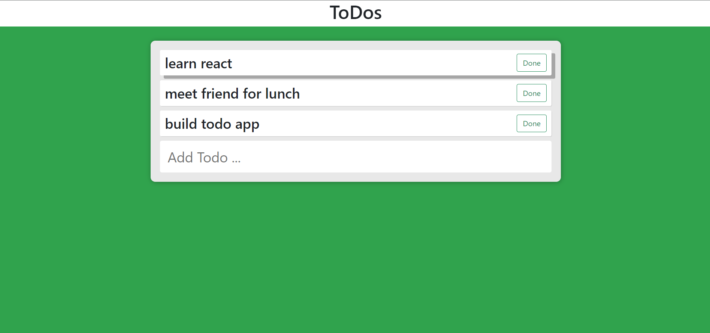
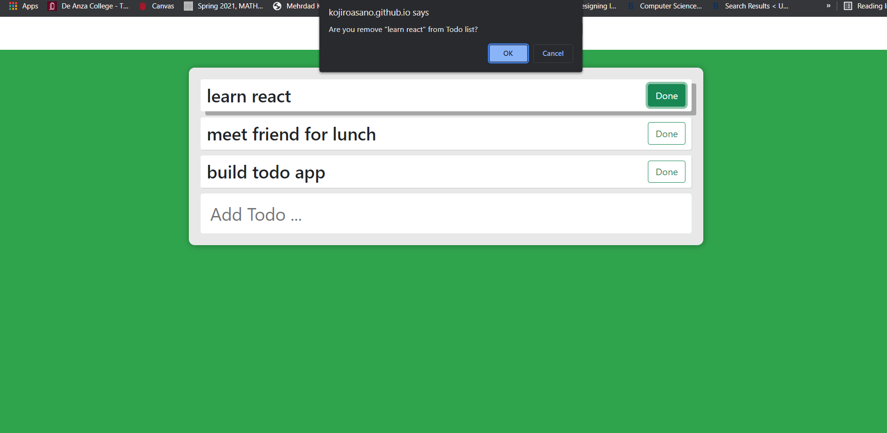

# ToDo-List
<div>


</div>

## Description:
  This program consists of javascript, html, and css.
  This program is Todo list. If you are done with your task and push "Done", then window asks if you want to remove the task from Todo list.

## Installation:
  1. Downloads each file into one file. <br>
    1. **index.html** <br>
    2. **index.js** <br>
    3. **form.js** <br>
    4. **todo.js** <br>
    5. **style.css** <br>
  3. Open shell and type **npm install --global http-server**.
     ```console
     npm install --global http-server
     ```
     or
     ```console
     npm install -g http-server
     ```
  4. Type **npm install**.
     ```console
     npm install
     ```
  5. type **http-server -c-1** to start the server.
     ```console
     http-server -c-1
     ```
  6. Go online and type **localhost:8080** in URL box.

  
## Usage:
**[Live app](https://kojiroasano.github.io/ToDo-List/)**
  <p>If successfully installed and run on the Web browser, the Todo list shows up. If you could not deal with daily work, try my todo list!!</p>
  
## Support:
  If any question, message me via **[my twitter](https://twitter.com/Kojiro38895598)**.
  
## Roadmap:
  I will restylize, might add modal, and improve form if possible.
  
## License information: 
Copyright 2022 Kojiro Asano

Permission is hereby granted, free of charge, to any person obtaining a copy of this software and associated documentation files (the "Software"), to deal in the Software without restriction, including without limitation the rights to use, copy, modify, merge, publish, distribute, sublicense, and/or sell copies of the Software, and to permit persons to whom the Software is furnished to do so, subject to the following conditions:

The above copyright notice and this permission notice shall be included in all copies or substantial portions of the Software.

THE SOFTWARE IS PROVIDED "AS IS", WITHOUT WARRANTY OF ANY KIND, EXPRESS OR IMPLIED, INCLUDING BUT NOT LIMITED TO THE WARRANTIES OF MERCHANTABILITY, FITNESS FOR A PARTICULAR PURPOSE AND NONINFRINGEMENT. IN NO EVENT SHALL THE AUTHORS OR COPYRIGHT HOLDERS BE LIABLE FOR ANY CLAIM, DAMAGES OR OTHER LIABILITY, WHETHER IN AN ACTION OF CONTRACT, TORT OR OTHERWISE, ARISING FROM, OUT OF OR IN CONNECTION WITH THE SOFTWARE OR THE USE OR OTHER DEALINGS IN THE SOFTWARE.
